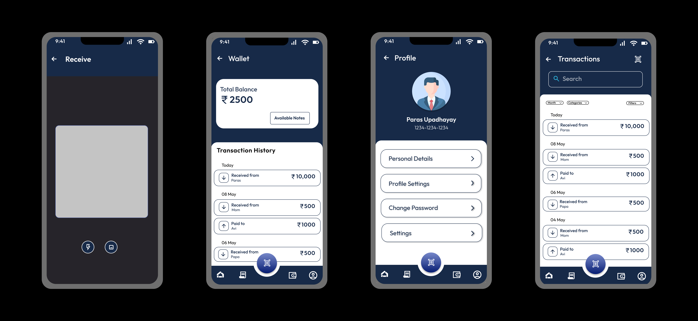
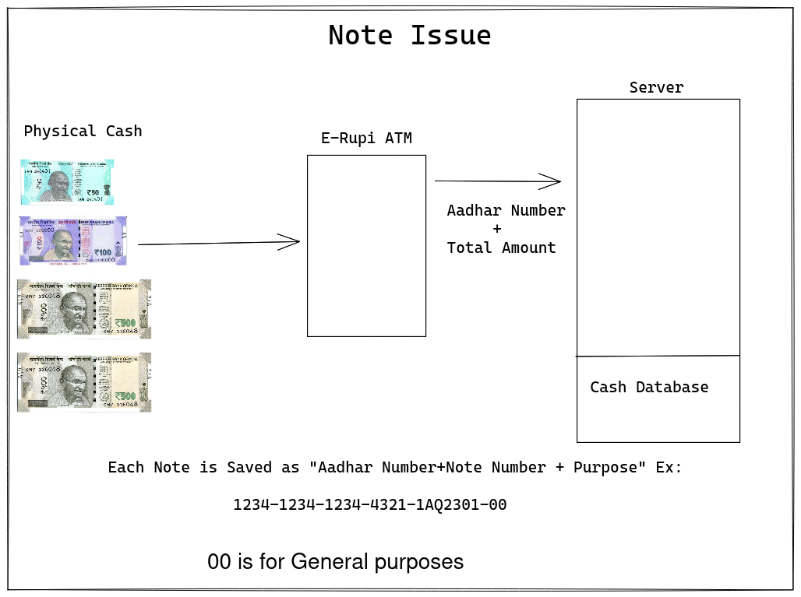
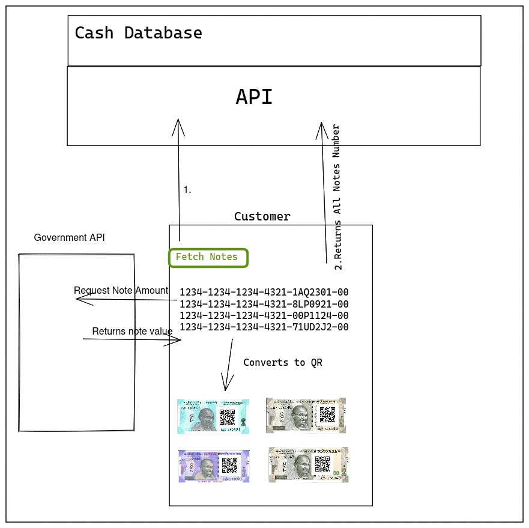
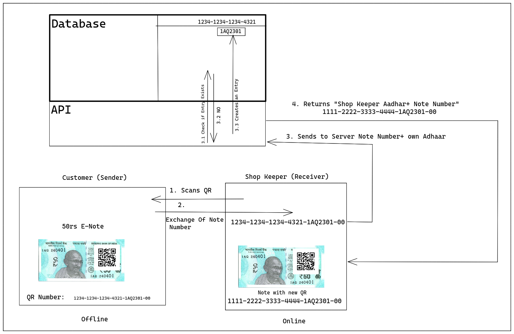
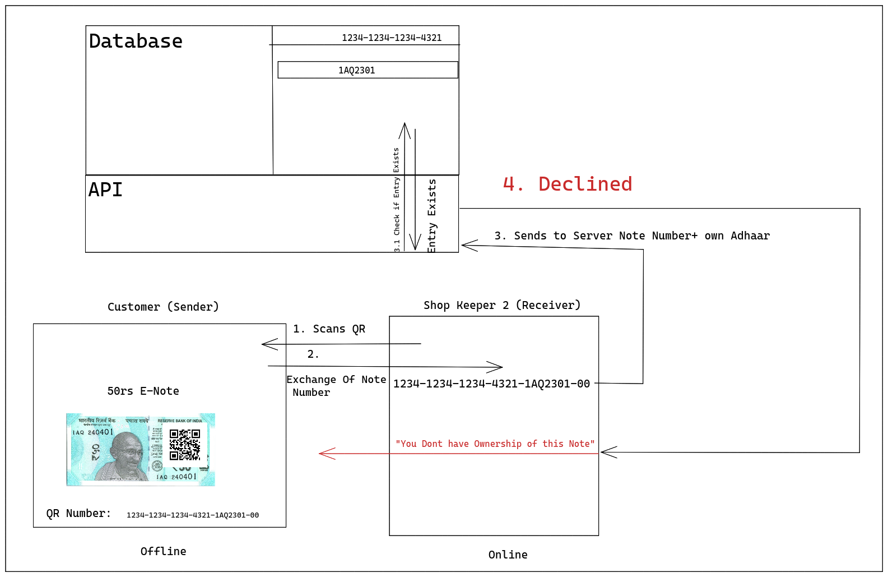
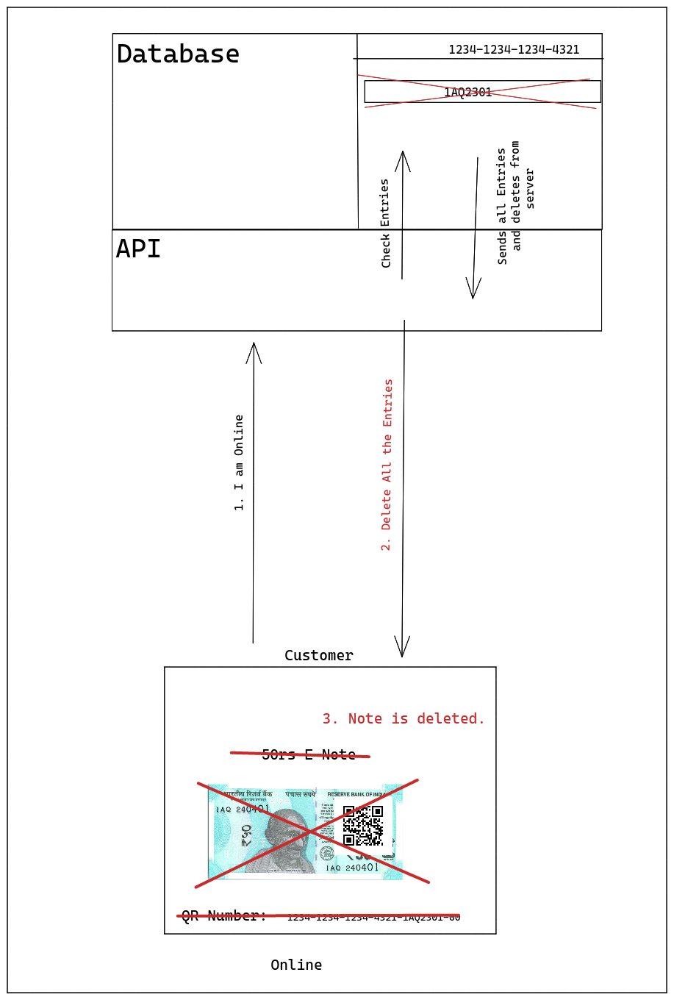
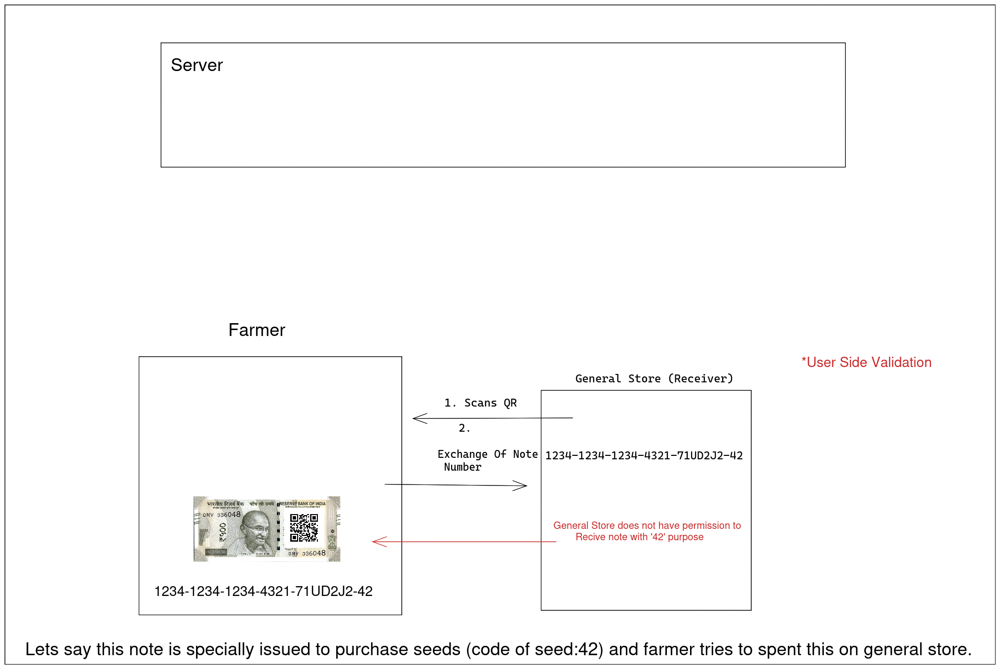

# Rupify: Redefining the way you pay

Rupify is an innovative fintech solution aimed at redefining digital finance by extending the capabilities of Erupee to enable seamless offline payments with partial server integration. By leveraging the power of Erupee and integrating it seamlessly with offline payment methods, Rupify aims to revolutionize the digital finance landscape, ensuring accessibility and security for users across diverse environments and connectivity scenarios.

## Introduction

Traditional payment methods often come with inconveniences and risks, while the adoption of digital cash faces various challenges. Rupify addresses these issues by providing users with a convenient, secure, and efficient way to manage and transact digital currency, even without a continuous internet connection.

## Key Features

### Aadhar Wallet Integration

Rupify integrates Aadhar Wallets with its backend infrastructure, creating secure digital wallets linked to users’ Aadhar information. This integration ensures a seamless user experience and enhances the security of transactions.

### Semi-Offline Payments

The concept of eRupee is extended to enable semi-offline payments, allowing users to transact securely even without a continuous internet connection. This feature ensures that users can make transactions anytime, anywhere, regardless of their connectivity status.

### Enhanced User Authentication

Rupify enhances user authentication and security by integrating OTP verification functionality in Django. This additional layer of security enhances the overall integrity of the platform and safeguards user accounts from unauthorized access.

### Robust Encryption

To ensure the highest level of data security, Rupify employs AES-256 Cipher for robust encryption of user information and transactions. This encryption mechanism protects sensitive data from unauthorized access and ensures the confidentiality of user information.

### Efficient Transaction Management

Rupify utilizes the Django framework to handle transactions and user wallet management efficiently. This ensures seamless operation and reliability, enabling users to manage their digital currency effortlessly.

## Screenshots

## Rupify Workflow Overview

## Getting Started

To get started with Rupify, follow these steps:

1. **Installation**: Clone the repository to your local machine.
2. **Setup Environment**: Set up your development environment and install the necessary dependencies.
3. **Configuration**: Configure the backend infrastructure according to your requirements, including database settings and environment variables.
4. **Run the Application**: Start the Rupify backend server and verify that everything is running smoothly.

## Contributing

We welcome contributions from the community to improve Rupify. To contribute, please follow these steps:

1. Fork the repository.
2. Create a new branch (`git checkout -b feature/improvement`).
3. Make your changes.
4. Commit your changes (`git commit -am 'Add new feature'`).
5. Push to the branch (`git push origin feature/improvement`).
6. Create a new Pull Request.

## License

Rupify is licensed under the [MIT License](LICENSE).

## Contact

For inquiries or assistance, please contact:

- **Yash Bansal** - [GitHub Profile](https://github.com/yash114bansal)
- **Paras Upadhayay** - [GitHub Profile](https://github.com/Pudv95)
- **Dhruval Gupta** - [GitHub Profile](https://github.com/Dig092)
- **Lakshya Goel** - [GitHub Profile](https://github.com/lakshya1goel)

